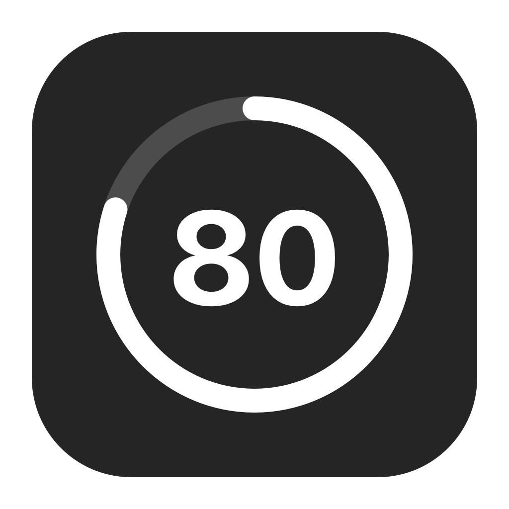

# Codex Quota



## 中文

原生 macOS 菜单栏额度组件，支持圆环和横条样式、悬停查看重置时间，以及跟随 Codex 启停。应用图标中的 80 是固定展示示意；菜单栏显示实际剩余额度。没有 Dock 图标。

### 安装与升级

双击 `CodexQuota-1.1.0-arm64.pkg`，按系统安装向导安装。支持 Apple Silicon、macOS 14+，目标为 `/Applications/Codex Quota.app`。安装包包含新应用图标和 Codex 启停跟随功能，并在 `/Library/LaunchAgents/local.codex.quota-ring.follow.plist` 安装登录启动配置，适用于此 Mac 的用户。

安装到当前系统时，安装脚本会停止当前登录用户的旧额度进程、迁移此前 `enable-follow.sh` 创建的同名用户配置，并启动新版后台监听。其他已登录用户需重新登录或重新打开应用；安装到其他系统卷时，下次登录该系统后生效。若安装后未自动启动，可从“应用程序”打开 Codex Quota。

Codex（`com.openai.codex`）运行时显示组件并读取额度；完全退出时隐藏组件并停止查询。关闭 Codex 窗口不等于退出。后台监听继续保留，以响应下次启动。菜单中退出额度应用会停止本次监听，重新打开应用或重新登录可恢复。`zsh enable-follow.sh` 可重新加载已安装的监听配置。

**旧版 `CodexQuota-1.0.0-arm64.pkg` 不包含启停跟随、新图标或登录启动配置。请安装 1.1.0；修改源码不会更新旧 PKG。** 本地安装包采用应用 ad-hoc 签名，没有 Developer ID 安装包签名或 Apple 公证。

如需停用所有用户的登录启动配置：

```sh
launchctl bootout "gui/$(id -u)/local.codex.quota-ring.follow"
sudo rm /Library/LaunchAgents/local.codex.quota-ring.follow.plist
```

此操作停止当前用户的监听并移除登录启动配置；其他已登录用户的监听需各自退出。重新安装 PKG 会恢复配置。

### 显示与数据

- 实线圆环代表剩余额度，中心为数字；横条左侧为加粗数字，右侧为 44 pt 余量条。样式选择自动保存。
- 优先显示 300 分钟（5 小时）窗口，只有周窗口时显示周余量，并在悬停和详情中说明。缺失窗口不代表无限制，无可识别窗口时显示横线。
- Codex 运行期间每 60 秒刷新，也可在菜单中立即刷新。失败保留上次数据、淡化圆环并显示错误。
- 用户级文件锁保证单实例；退出或崩溃后系统释放锁。

通过本机 Codex `app-server --listen stdio://` 初始化后调用 `account/rateLimits/read`，优先使用 `rateLimitsByLimitId.codex`，兼容 `rateLimits`。使用 Codex 自身的登录状态，不读取或保存账号凭证，不发起模型任务。

查找 ChatGPT / Codex 应用内置 CLI 和 Homebrew 路径；可用 `CODEX_BINARY` 指定。需要已登录的 Codex 和网络连接。此实验性接口可能随 Codex 更新而变化。

### 构建

`version.env` 统一维护应用版本和构建号。`Sources/main.swift` 包含客户端和菜单栏实现；`Assets/` 保存图标；`Installer/` 保存双语向导、LaunchAgent 和安装脚本。

```sh
zsh build.sh
'Codex Quota.app/Contents/MacOS/CodexQuota' --self-test
zsh package.sh
```

`package.sh` 自动从当前源码重新构建、签名并生成当前版本 PKG，避免打包旧应用。`--probe` 可查询真实额度；需要登录状态和网络。菜单栏视觉、悬停、点击及完整安装/登录流程仍需在桌面实际验收。

## English

A native macOS menu bar quota companion with ring and bar styles, reset-time tooltips, and Codex lifecycle following. The app icon's 80 is an illustration; the menu bar shows actual remaining quota. There is no Dock icon.

### Install and upgrade

Open `CodexQuota-1.1.0-arm64.pkg` and follow the system installer. Requires Apple Silicon and macOS 14+. Installs `/Applications/Codex Quota.app`, the new app icon, lifecycle following, and `/Library/LaunchAgents/local.codex.quota-ring.follow.plist` for startup at user login on this Mac.

When installing on the current system, the installer stops the console user's old quota process, migrates the same-name user agent previously created by `enable-follow.sh`, and starts the updated listener. Other logged-in users should log in again or reopen the app. Installation on another system volume takes effect at the next login there. If it does not start automatically, open Codex Quota from Applications.

The menu bar item appears and reads quota while Codex (`com.openai.codex`) runs. Fully quitting Codex hides the item and stops queries; closing its window does not quit it. The background listener remains available for the next launch. Quitting the quota app stops the listener until you reopen it or log in again. `zsh enable-follow.sh` reloads the installed agent.

**The old `CodexQuota-1.0.0-arm64.pkg` does not include lifecycle following, the new icon, or login startup. Install 1.1.0; source changes do not update the old PKG.** The app is ad-hoc signed; the package has no Developer ID signature or Apple notarization.

To disable login startup for all users, run the two commands in the Chinese section above. They stop the current user's listener and remove the shared startup configuration. Other active users must quit their own listener. Reinstalling the PKG restores the configuration.

### Display and data

- The solid ring represents remaining quota with a central number. The bar style has a bold number and a 44 pt bar. Your style selection is saved.
- Prefers the 300-minute (5-hour) window; falls back to weekly quota with context in tooltips and details. Missing windows do not mean unlimited usage; no recognized window displays a dash.
- Refreshes every 60 seconds while Codex runs, with manual refresh available. Failures retain previous data, dim the ring, and show an error.
- A user-level file lock enforces a single instance and is released on exit or crash.

Initializes the local Codex `app-server --listen stdio://`, then calls `account/rateLimits/read`. Prefers `rateLimitsByLimitId.codex`, with `rateLimits` compatibility. Uses Codex's existing login without reading or storing credentials or initiating model tasks.

Searches bundled ChatGPT / Codex CLIs and Homebrew paths; override with `CODEX_BINARY`. Requires a logged-in Codex installation and network access. This experimental interface may change with Codex updates.

### Build

`version.env` owns the application version and build number. `Sources/main.swift` contains the client and menu bar implementation; `Assets/` contains icons; `Installer/` contains bilingual installer pages, the LaunchAgent, and installation scripts.

Use the build, self-test, and package commands above. `package.sh` automatically rebuilds and signs the current source before creating the versioned PKG, preventing stale app packaging. `--probe` queries live quota and requires login and network access. Menu bar visuals, hover/click interactions, and full install/login behavior still require desktop acceptance testing.
